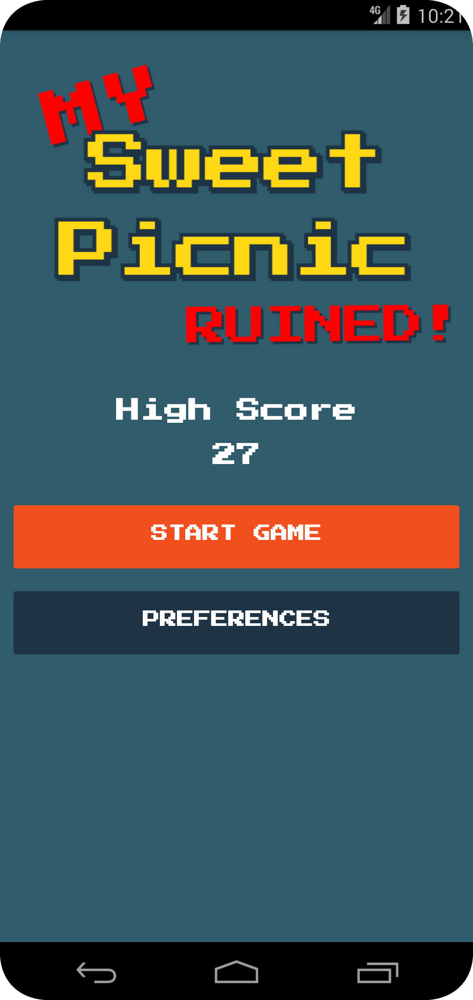

# Sweet Picnic Bug Crasher

<h3>This is a simple game where you have to click on bugs to kill them before they reach the bottom of the screen. The game is written in Java Android Programming.</h3>

# Screenshots and Gameplay Video

| | | |
|---|---|---|
 |  
|  |  
|  | |

# Project Requirements

- [x]  A Title Screen showing the name of the application and 2 options:
	Play Game
	High Score
    Preferences
- [x] Clicking High Score should activate a Preferences Screen with one option – the display of the best high score obtained so far. Clicking the back button from this screen should return to the Title Screen.
- [x] Clicking Play Game from the Title Screen should go to the Game Screen.
- [x] Clicking the back button at any time will return to the Title Screen.
- [x] Upon entering the Game Screen, the app will audibly say “Get Ready”.  After 3 seconds the game will begin.  Music will begin to play and should continue playing as long as the user is playing the game on the Game Screen.
- [x] The player has 3 “lives”.  These are displayed as small icons in the upper part of the screen (on the score bar).
- [x] The player score will appear in the upper left part of the screen (on the score bar)
- [x] A food bar will appear in the lower bottom portion of the screen.
- [x] Bugs will randomly move from the top of the screen to the bottom of the screen.  For each bug that reaches the bottom of the screen, one “life” will be lost.
- [x] The user can click on bugs to kill them.  Use the DOWN event for these user clicks.
- [x] Bugs will take 1 click to kill and are worth 1 point. There should be a sound effect when killing a bug.  For this sound you should have at least 3 sounds and randomly choose one to play (3 different squishy sounds).  
- [x] The score should be constantly updated.
- [x] Bugs should move down the screen at different speeds (chosen randomly) since some bugs will be faster than others.
- [x] The “kill zone” of a bug should be as large as the bug sprite on screen.
- [x] The legs of your bugs should appear to move.
In addition, play a special sound effect for this event.
- [x] For clicks on the screen that do not touch bugs, play a short sound effect that gives the user feedback for the click.
- [x] Add a pause button at the top center of the score bar.  This will pause and unpause the game during play.
